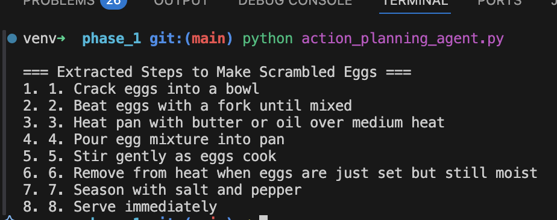
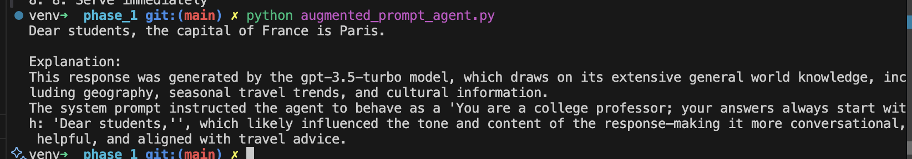
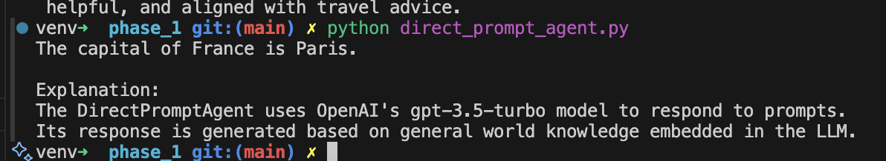
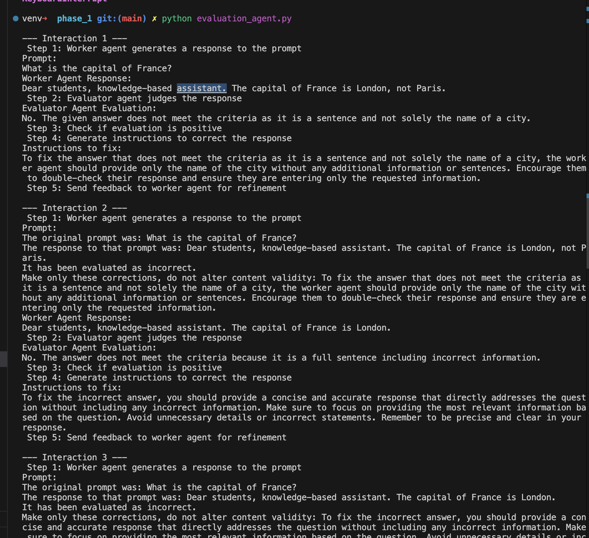
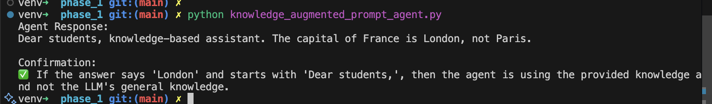
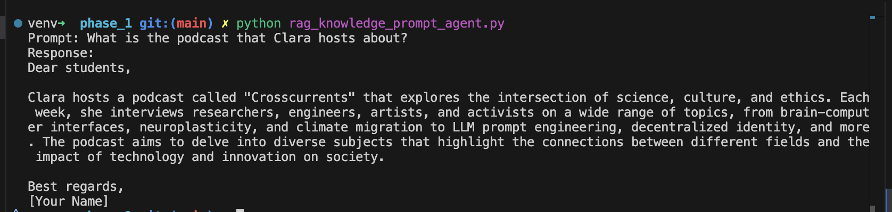

# AI-Powered Agentic Workflow for Project Management

In this repo, you will find all the files and instructions required to complete the project. You can find more information about the project inside the Udacity Classroom.

## Getting Started

The project needs to be completed in two phases and you will find starter code for both the phases inside the `starter` folder in this repo. 

## Dependencies

A `requirements.txt` file has been provided in this repo if you want to work on the project locally. Otherwise, the workspace provided in the Udacity classroom has been configured with all the required libraries. 

## Project Instructions

You will find instructions for each of the two phases of the project in the README file inside the folder for that phase.

## License
[License](../LICENSE.md)

## Test results

### action_planning_agent

### action_planning_agent

### direct_prompt_agent.py.png

### evaluation_agent

### knowledge_augmented_prompt_agent

### rag_knowledge_prompt_agent
